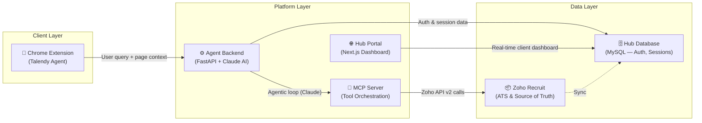
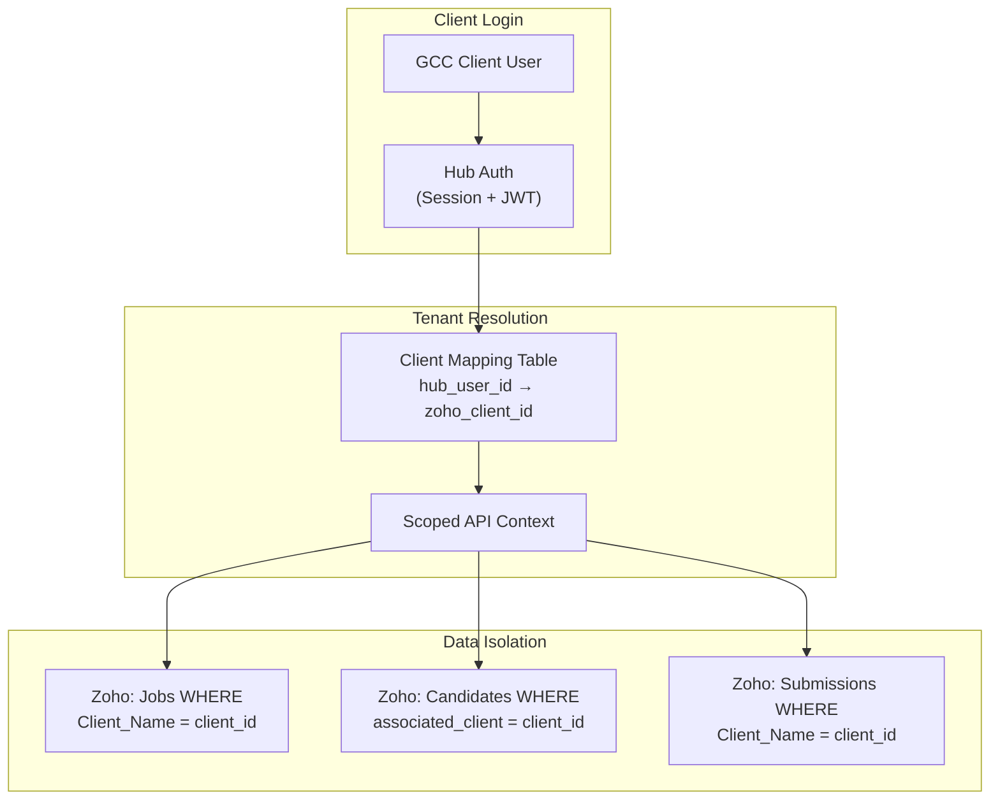
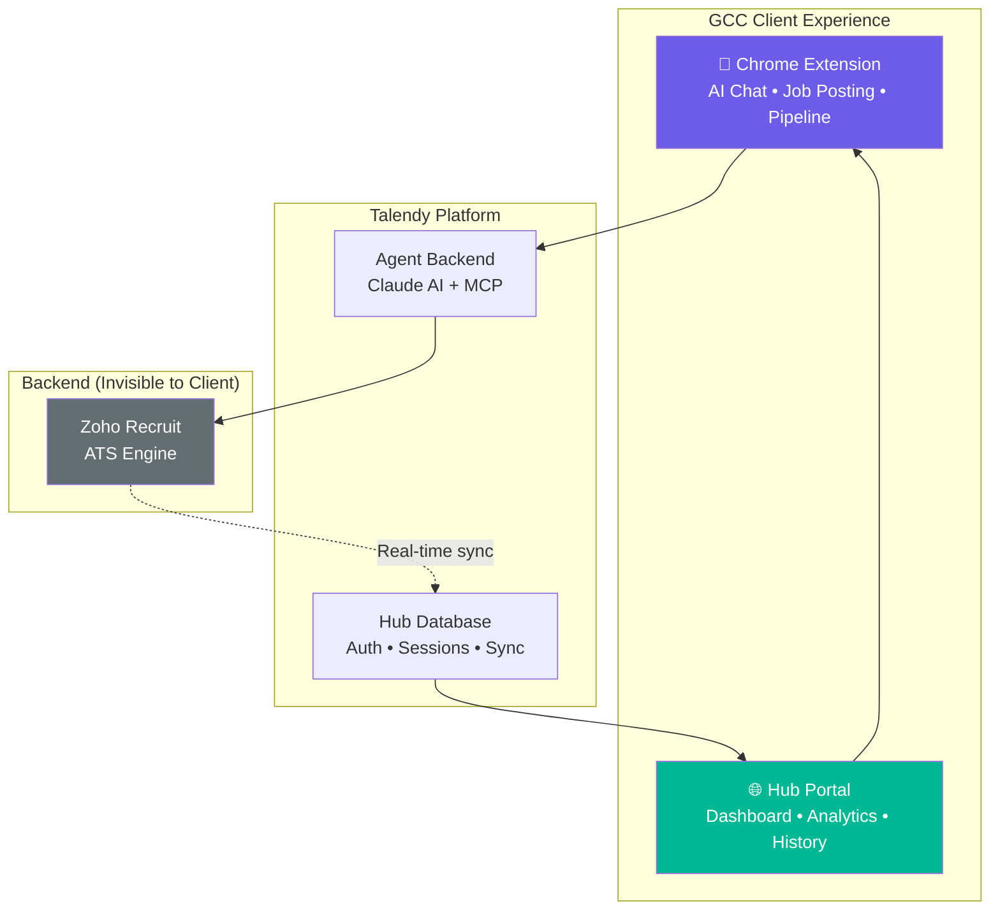

# Talendy AI Agent — Executive Brief
**Talendy | Strategy & High-Level Design | March 2026**

---

## 1. System Overview

Talendy is an AI-powered hiring assistant built as a **Chrome Extension** for GCC clients. It enables recruiters and hiring managers to manage their entire recruitment workflow — from job creation to candidate pipeline management — through a conversational AI interface, without needing to learn complex ATS software.

### How It Works Today

The system operates across three layers:

**Flow:** A client user interacts with the Talendy Chrome Extension on any webpage (e.g., LinkedIn). The extension sends the user's query and page context to the **Agent Backend**, which runs an agentic loop powered by Claude AI. Claude decides which recruitment tools to invoke via the **MCP Server**, which translates them into Zoho Recruit API v2 calls. Results are formatted and streamed back to the user in real-time.

### Multi-Tenancy Architecture (Planned)

Client isolation will be achieved by mapping **Hub Auth credentials → Zoho Client ID**, ensuring each GCC client only accesses their own data.

A new **`client_mappings`** table in the Hub database will link each authenticated user to their Zoho `Client_Name` record. Every MCP tool call will automatically inject a `Client_Name` filter using Zoho's `criteria` parameter (e.g., `(Client_Name:equals:{client_id})`), guaranteeing data isolation at the API layer without any changes to Zoho's infrastructure.

---

## 2. Current Capabilities (23 Tools)

| Category | Tools | What It Enables |
|---|---|---|
| **Job Management** | List, Get, Create, Search, Archive | Full job lifecycle from creation to close-out |
| **Candidate Ops** | Create, Search, Get, List All, Import Resume | Source, parse resumes, and manage talent pool |
| **Pipeline** | Associate, Get by Job, Update Status | Move candidates through hiring stages |
| **Clients & Contacts** | List Clients, Get Client, List Contacts | View client organizations and POCs |
| **Engagement** | Add/List Notes, List/Get Interviews | Track internal notes and interview schedules |
| **Documents** | List/Upload Attachments, Categories | Manage resumes and supporting documents |

---

## 3. Planned Capability Expansion

| New Module | Key Tools | Business Value |
|---|---|---|
| **Submissions** | Create, List, Update Status | Formal candidate-to-client submission tracking |
| **Assessments** | List results | Pre-screening and technical test visibility |
| **Reviews** | List feedback | Hiring manager interview feedback loop |
| **Tags** | Add, List | Smart labeling for faster filtering |
| **Admin** | Org Details, List Users | Org context for personalization and coordination |
| **Guardrails** | Confirmation prompts, PII masking | Prevent unauthorized bulk actions and data leakage |

---

## 4. Talendy Assistant in the Talendy Ecosystem

| Surface | Audience | Purpose |
|---|---|---|
| **Chrome Extension** | GCC Client (Recruiter/HM) | Conversational AI for day-to-day hiring actions |
| **Hub Portal** | GCC Client (Manager/Exec) | Dashboard view of jobs, candidates, analytics — synced in real-time from Zoho |
| **Agent Backend** | Internal (Platform) | AI orchestration, auth, session management |
| **Zoho Recruit** | Internal (Hidden) | Source-of-truth ATS — never exposed to clients |

**Key Principle:** Clients interact *only* with the Talendy-branded surfaces (Extension + Hub). Zoho Recruit operates as the invisible ATS engine. All data shown on the Hub Portal is synced in real-time from Zoho, providing clients with a unified, white-labeled experience under the Talendy brand.

---

*Prepared by Nitai Agarwal — Consultant, Talendy*
